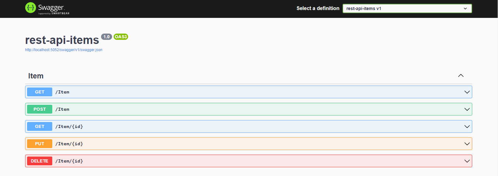
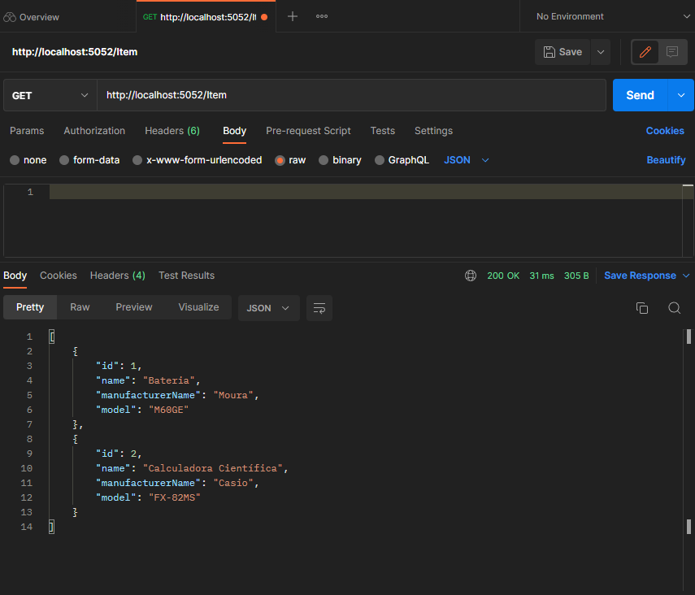
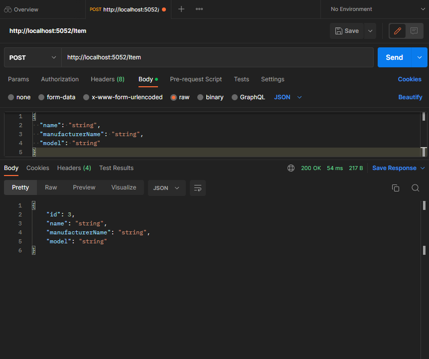
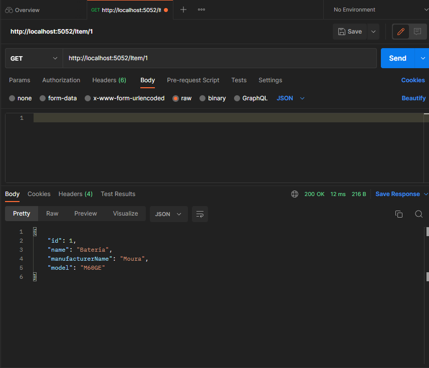
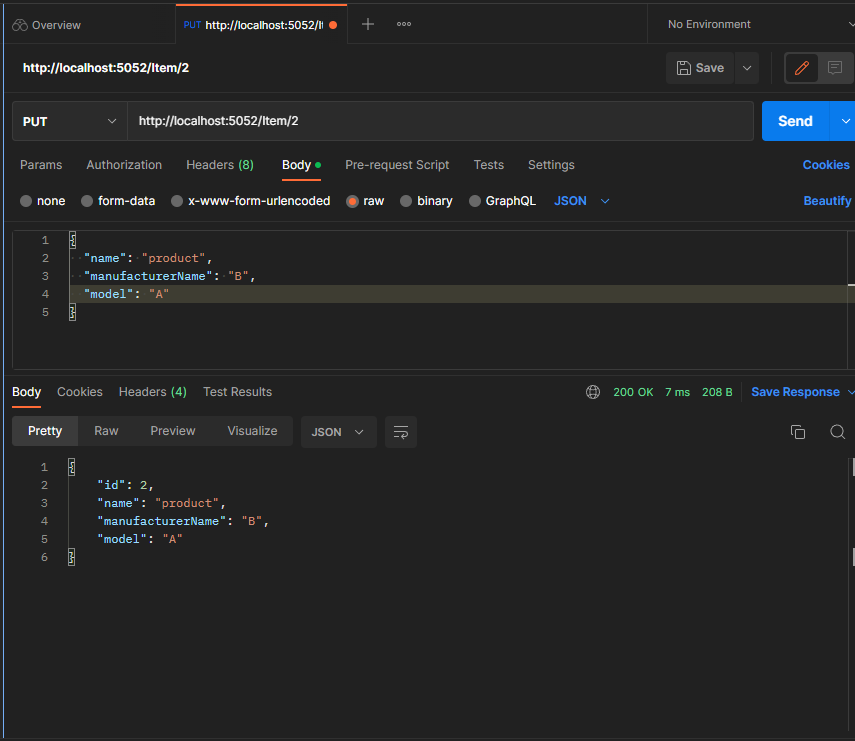

# API REST

A project made in .NET, EF core and AutoMapper, for understanding the MVC model

## 🛠️ Tecnologias

1. [.NET](https://dotnet.microsoft.com/pt-br/)
2. [Microsoft Entity Framework Core](https://www.nuget.org/packages/Microsoft.EntityFrameworkCore)
3. AutoMapper

## 📷 Imagens de testes com o PostMan

- GET
  

---

- POST
  

---

- GET BY ID
  

---

- PUT
  

---

- DELETE
  
